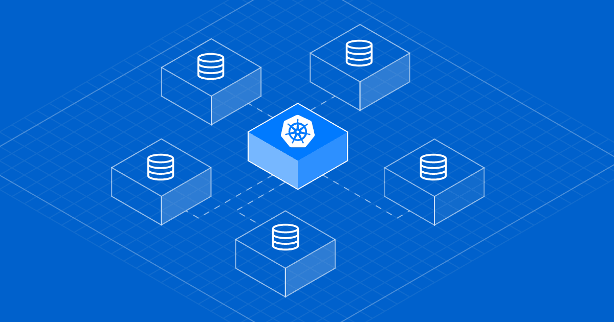

# Kubernetes Deployment



## Introduction
The repository was created for fast development of backend applications using Kubernetes orchestration system.

Kubernetes is an open-source container-orchestration system for automating computer application deployment, scaling, and management of containerized applications. Kubernetes gives Pods their own IP addresses and a single DNS name for a set of Pods, and can load-balance across them. Scales the application up and down with a simple command, with a UI, or automatically based on CPU usage.

## Usage
The instructions below shows how to deploy using Kubernetes

### Prerequisites
 - Docker
 - Node
 - Kubectl

### Command to build and run docker image

Generate a docker image of the application and publish to Docker Repository. In the example below we have created as saranshmanu/kubernetes-app

```Bash
docker build -t saranshmanu/kubernetes-app .
docker run -p 3000:3000 -d saranshmanu/kubernetes-app
docker push saranshmanu/kubernetes-app
```

### Install and Initiate Minikube
Minikube is a tool that lets you run Kubernetes locally. Minikube runs a single-node Kubernetes cluster on your personal computer. It allows us to run our application inside the Docker environment using NodePort but does not have support for LoadBalancer as of today. We will have to use a Cloud Provider the same.

```Bash
brew install minikube
minikube start
# To use Dashboard for management
minikube dashboard
```

### Kubernetes Nodes

```Bash
kubectl get nodes
kubectl get nodes -o wide
```

### Format for deployment.yml

```Kubernetes
apiVersion: apps/v1
kind: Deployment
metadata:
  name: kubernetes-app
spec:
  replicas: 2
  selector:
    matchLabels:
      app: kubernetes-app
  template:
    metadata:
      labels:
        app: kubernetes-app
    spec:
      containers: 
      - name: kubernetes-app
        image: saranshmanu/kubernetes-app
        ports:
        - containerPort: 3000
```

### Create Kubernetes Deployment and Expose to public

```Bash
kubectl create -f deployment.yml --save-config
# To check the deployments pods
kubectl get pods
# To check logs of the pod
kubectl logs <pod-name>
# Expose the Service to Internet
kubectl expose deployment <app-name> --type="NodePort" --port=3000
# Check Public IP for Minikube
minikube ip
# To apply updates
kubectl apply -f deployment.yml
```

Minikube does not provide an External IP for accessing the service so we will have to use the command below to connect to the API. It will create a tunnel for the service.

```Bash
minikube service <service-name> --url
```

### To get all kubernetes deployments and delete

```Bash
kubectl get deployments
kubectl delete deployments <service-name>
```

### To get all kubernetes services and delete

```Bash
kubectl get services
kubectl delete services <service-name>
```

## Contributing
Pull requests are welcome. For major changes, please open an issue first to discuss what you would like to change.

## License
[MIT](https://choosealicense.com/licenses/mit/)